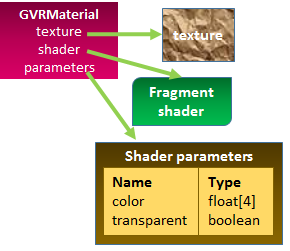

VR materials, access, and examples

A material dictates how a scene object will be colored and textured. The visual appearance of a mesh in the scene is controlled by a fragment shader program in the GPU. GearVRf will automatically construct a shader for common use cases but you can also provide your own shader code.

The GVRMaterial object encapsulates the fragment shader and all of its associated data. This usually includes one or more texture maps and lighting properties that affect how the surface reacts to lights in the scene. Because you can write custom shaders, you can attach your own custom data to a material that your shader can use in computations. This data can be scalar numbers (float or int), arrays or textures. Each custom data element has a string key used to look up or modify its value. When the object is rendered, these values are passed to the shader program.

This picture shows a material with two custom data parameters - a diffuse color with an alpha (4 floats) and an integer enabling transparency. 




##Accessing Material Parameters

The GVRMaterial provides access to the fragment shader uniforms by name. Setting the value of a material parameter will set the correspondingly named uniform variable in the fragment shader associated with that material. GVRMaterial has a set of functions that read and write the material parameters based on type.

|Shader Type| GVRMaterial Setter| GVRMaterial Getter|
|-----------|---------------|---------------|
|float |	setFloat(String name, float v) |	float getFloat(String name)|
|float2 |	setVec2(String name, float[] v) |	float[] getVec2(String name)|
|float3 |	setVec3(String name, float[] v) |	float[] getVec3(String name)|
|float4 |	setVec4(String name, float[] v) |	float[] getVec4(String name)|

##Material Construction Example

A material contains all the data required for the specific shader you are going to use. You will set up different parameters for different shaders. GearVRF has several GearVRfDeveloperGuide.LegacyShaders which can render meshes in a variety of ways. All of them use the same GVRMaterial object but with different properties.

In this example we construct a GVRMaterial to be used with the phong shader. This shader requires us to provide a diffuse texture as well as material and lighting properties.

```java
GVRMaterial createMaterial(GVRContext gvrContext)
{
   GVRMaterial material = createMaterial(gvrContext);
   GVRTexture tex = gvrContext.loadTexture(new GVRAndroidResource(gvrContext,R.drawable.gearvr_logo));

   material.setDiffuseColor(0.5f, 0.5f, 0.5f);
   material.setAmbientColor(1.0f, 1.0f, 1.0f, 1.0f);
   material.setSpecularColor(1.0f, 1.0f, 1.0f, 1.0f);
   material.setSpecularExponent(128.0f);
   return material;
}
```