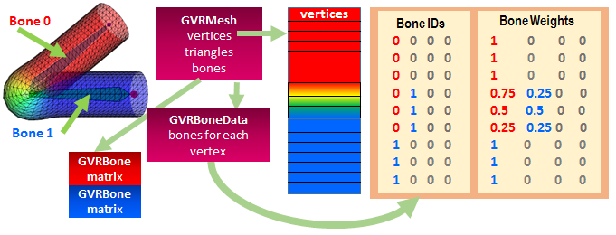

VR mesh types, access, and examples

Indexed triangle meshes are the only shape definition currently supported by GearVRF. Each mesh contains a set of vertices with the 3D locations of the triangle coordinates. Typically these are unique locations to maximize vertex sharing but this is not a requirement. A triangle has three indices designating which vertices are used by that triangle.

In addition to positions, a mesh may have normals and texture coordinates as well. These arrays, if present, must follow the same ordering as the vertices. There is only one set of triangle indices to reference the position, normal and texture coordinate. This is unlike some systems which permit multiple index tables. 


##Skinned Meshes

Skinned meshes have vertex bone data to indicate which bones affect which vertices in the mesh. A bone is a transform matrix which affects a subset of vertices in the mesh. Each vertex can be influenced by up to four bones.

A mesh also contains a list of the bone transforms (GVRBone objects) that influence its vertices. The bone indices in the vertex array reference the bones in this list.

GearVRf executes skinning on the GPU but it calculates the bone matrices on the CPU.



##Accessing Mesh Components

The vertex shader used to render the mesh determines which vertex components are required. The GearVRf build-in shaders rely on positions, normals, texture coordinates and bone information. You can write your own shaders which use other vertex components.

Each vertex component has a unique name and type. GearVRf vertex components are vectors containing between one and four floats. Each component has a function wh|ich can get or set that component for the entire vertex array. GVRMesh provides convenience functions for the built-in types. Reading or writing the vertex array is a high overhead operation and should not be done every frame.

The index array describes an indexed triangle list. Each triangle has three consecutive 32-bit indices in the array designating the vertices from the vertex array that represent that triangle. The setIndices andgetIndices function provide access to the GVRMesh triangle data.

|Shader Name| GVRMesh Setter| GVRMesh Getter|
|-----------|---------------|---------------|
|a_position |setVertices(float) |float[] getVertices()|
|a_normal |setNormals(float[]) |float[] getNormals()|
|a_texcoord |setTexCoords(float[]) |float[] getTexCoords()|


|Shader Type| GVRMesh Setter| GVRMesh Getter|
|-----------|---------------|---------------|
|float3 |setVec3Vector(String name, float[]) |float[] getVec3Vector(String name)|
|float2 |setVec2Vector(String name, float[]) |float[] getVec2Vector(String name)|
|float4 |setVec4Vector(String name, float[]) |float[] getVec4Vector(String name)|
|float |setFloatVector(String name, float[]) |float[] getFloatVectorString name()|

##Mesh Construction Example

Most of the time your code will obtain meshes by loading asset files. You can also construct or modify meshes programmatically. A mesh may contain positions, normal and texture coordinates. Depending on the shader used to display the mesh, some of these vertex components may not be used. For example, a shader which does not do lighting will typically not need normals. You can omit the normals and texture coordinate arrays if your shader doesn't need them.

This function constructs a mesh of two triangles with only positions and normals. (If you try to use a textured shader with this mesh, you will get an error.)

```java
GVRMesh createMesh(GVRContext gvrContext)
{
    GVRMesh mesh = new GVRMesh(gvrContext);
    float[] vertices =
    {
        -1.0f, 0.0f, 0.0f,
        0.0f, 1.0f, 0.0f,
        1.0f, 0.0f, 0.0f,
        0.0f, -1.0f, 0.0f
    };
    float[] normals =
    {
        0, 0, 1,
        0, 0, 1,
        0, 0, 1,
        0, 0, 1
    };
    char[] triangles = { 0, 1, 2, 2, 3, 0 };
    mesh.setVertices(vertices);
    mesh.setNormals(normals);
    mesh.setTriangles(triangles);
    return mesh;
}
```

You need to attach your mesh to a GVRSceneObject before it can be displayed. The GVRRenderData object holds both a mesh and a material. Each visible scene object must have render data. This code adds the newly constructed mesh to the scene. Here we assume the GVRMaterial has already been constructed.

```java
GVRMesh mesh = createMesh(gvrContext);
GVRSceneObject obj = new GVRSceneObject(gvrContext, mesh);
GVRRenderData rdata = obj.getRenderData();
rdata.setMaterial(material);
```

