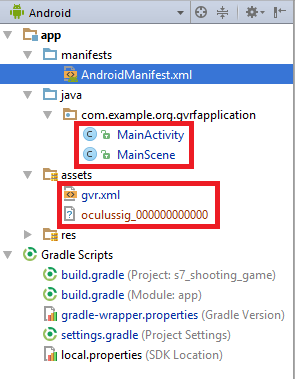

## Overview
After setting up GearVR Framework, let's create our first VR app. And we'll learn a few very important concept in the process.

## Create Project
The easiest way to create a project is by copying the [template project](https://github.com/nitosan/GearVRf-template) 

## Project Structure
Before we start, let's take a look at some essential parts of fo a GearVR Framework app



The template project contains two classes, `MainActivity` and `MainScene`

* `MainActivity` is the entry point of the app, like `android.app.Activity` it handles the initialization and life cycle of a VR app.

* `MainScene` is the container of a scene, just like a scene in the movie, it contains things like camera, characters, visual effects etc

In the assets folder there are two files: `gvr.xml` and `oculussig` file

* `gvr.xml` is where you config various behavior of GearVR framework, which we'll get into detail in future tutorials

* `oculussig` is the oculus signing file which allows you to deploy debug apps to VR devices, so always make sure this you have a signing file in your project


## Scene
Usually a VR app/game is made up of one or more scenes. The templeate project already created one Scene for you named `MainScene` by create a child class from `GVRMain`

There are two functions in `MainScene` both are important for the scene to work

* onInit() called once while loading the scene, can be used tp perform actions like object creation, assets loading here.
* onStep() called once per frame, can be used to perform things like animation, AI or user interactions

### Add object

Adding a object to the scene is simple, just create the object and specify the material and add it to the scene

First let's add a new member varible to the `MainScene`
```java
	GVRCubeSceneObject mCube
```

Let's add a cube to our scene with following code in `onInit()` function
```java
	//Create a cube
	mCube = new GVRCubeSceneObject(gvrContext);

	//Set shader for the cube
	mCube.getRenderData().setShaderTemplate(GVRPhongShader.class);

	//Set position of the cube at (0, -2, -3)
	mCube.getTransform().setPosition(0, -2, -3);
	
	//Add cube to the scene
	gvrContext.getMainScene().addSceneObject(mCube);
```

Build and run the app, you should be able to see a white cube on the screen

!!!note
	If you're using "VR developer mode" without headset the orentation might be different, you might need to turn around to see the cube

### Make it move

Now let's make the cube rotate

Add following code to the `onStep()` function

```java

	//Rotate the cube along the Y axis
	mCube.getTransform().rotateByAxis(1, 0, 1, 0);

```

Now build and run the app, you should be able to see the cube is rotating

[Source Code](https://github.com/gearvrf/GearVRf-Demos)
